# Racing Post Scraper - Architecture Documentation

## Table of Contents

1. [Overview](#overview)
2. [High-Level Architecture](#high-level-architecture)
3. [System Components](#system-components)
4. [Data Flow](#data-flow)
5. [AWS Infrastructure](#aws-infrastructure)
6. [Daily Pipeline](#daily-pipeline)
7. [Scheduling System](#scheduling-system)
8. [Rust Application Structure](#rust-application-structure)
9. [Lambda Function](#lambda-function)
10. [S3 Data Organization](#s3-data-organization)
11. [Timezone Handling](#timezone-handling)
12. [Error Handling](#error-handling)
13. [Deployment](#deployment)
14. [Monitoring and Logging](#monitoring-and-logging)
15. [Security Considerations](#security-considerations)
16. [Performance Considerations](#performance-considerations)
17. [Scalability](#scalability)
18. [Backup and Recovery](#backup-and-recovery)
19. [Testing Strategy](#testing-strategy)
20. [Future Enhancements](#future-enhancements)

---

## Overview

The Racing Post Scraper is a comprehensive data collection and analysis system for horse racing data. It scrapes racecard and results data from Racing Post, processes it into structured Parquet files, computes probabilities using historical data, and serves HTML reports via a Lambda-powered API.

### Key Features

- **Automated Scraping**: Daily automated scraping of racecards and results from Racing Post
- **Data Processing**: Conversion of raw HTML to structured Parquet format
- **Probability Computation**: Model-based probability calculations using historical data
- **Scheduling**: Dynamic scheduling based on actual race times in Europe/London timezone
- **Reporting**: HTML reports with bookmaker odds, model probabilities, and edge analysis
- **AWS Integration**: Full AWS infrastructure with ECS, Lambda, S3, and EventBridge

### Technology Stack

- **Rust**: Core scraping and processing logic
- **Python**: Orchestration, scheduling, and Lambda functions
- **Terraform**: Infrastructure as Code for AWS resources
- **AWS**: ECS, Lambda, S3, EventBridge, API Gateway, Glue
- **Chromium**: Headless browser for JavaScript-rendered content
- **Parquet**: Columnar storage format for efficient data processing
- **Bootstrap**: Frontend framework for HTML reports

---

## High-Level Architecture

The system consists of three main layers:

1. **Data Collection Layer**: Rust-based scrapers running on ECS
2. **Data Processing Layer**: Glue ETL jobs and Rust processors
3. **Data Presentation Layer**: Lambda function serving HTML reports via API Gateway

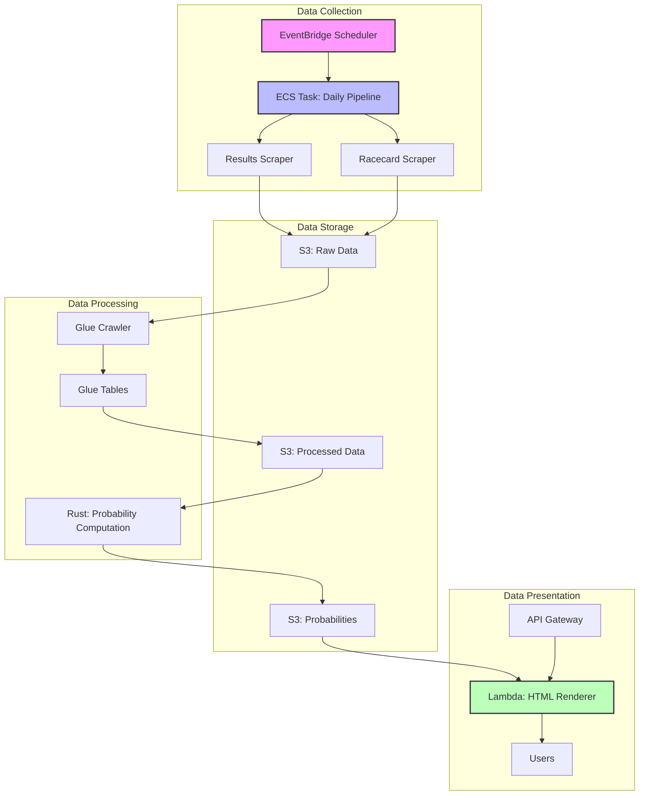

### Component Interaction

The system follows an event-driven architecture where EventBridge triggers ECS tasks based on race times. The daily pipeline orchestrates multiple scraping and processing steps, storing intermediate results in S3. The Lambda function serves on-demand HTML reports by reading from S3.

---

## System Components

### Rust Binaries

The Rust application provides multiple binaries for different purposes:

| Binary | Purpose | Input | Output |
|--------|---------|-------|--------|
| `racingpost_scraper` | Main results scraper | Date argument | HTML results |
| `racecards_time_order_scraper` | Racecard scraper | Date argument | HTML racecards |
| `racecard_html_dir_parser` | Parse racecard HTML | HTML directory | Parquet runners |
| `today_first_race_table` | Compute probabilities | Runners + history | Parquet probabilities |
| `backtest` | Backtesting | Historical data | Performance metrics |
| `full_result_parser` | Parse results HTML | HTML results | Structured data |

### Python Scripts

| Script | Purpose |
|--------|---------|
| `daily_pipeline.sh` | Orchestrates daily scraping and processing |
| `schedule_today.py` | Creates EventBridge rules based on race times |
| `process_captured_s3.sh` | Triggers Glue processing for S3 data |
| `backfill_last_2_years.sh` | Backfills historical data |

### Terraform Modules

| Module | AWS Resources |
|--------|---------------|
| `main.tf` | Terraform configuration and provider |
| `vpc.tf` | VPC, subnets, security groups |
| `ecs_cluster.tf` | ECS cluster |
| `task_definition_*.tf` | Various ECS task definitions |
| `lambda.tf` | Lambda function and API Gateway |
| `s3_data_bucket.tf` | S3 data bucket |
| `iam.tf` | IAM roles and policies |
| `glue_*.tf` | Glue database, crawler, tables |
| `schedule.tf` | EventBridge schedule group |

---

## Data Flow

### End-to-End Data Pipeline

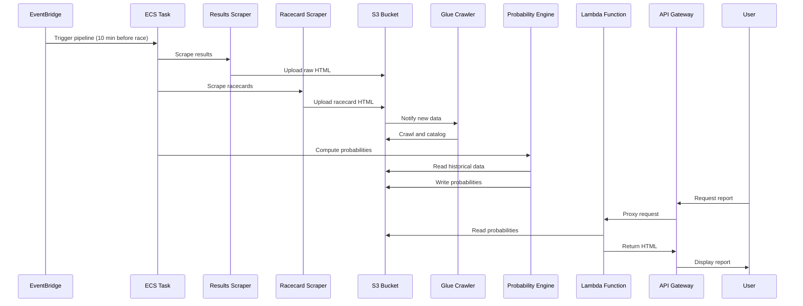

### Daily Pipeline Steps

The daily pipeline (`daily_pipeline.sh`) executes the following steps:

1. **Browser Setup**: Start Xvfb and Chromium with remote debugging
2. **Results Scraping**: Scrape full results for the specified date
3. **Raw Data Upload**: Upload raw HTML to S3
4. **Results Processing**: Trigger Glue to process results into Parquet
5. **Browser Restart**: Restart Chromium for racecard scraping
6. **Racecard Scraping**: Scrape racecard data with time-based filtering
7. **Racecard Parsing**: Parse racecard HTML into runners Parquet
8. **Runners Upload**: Upload runners Parquet to S3
9. **History Download**: Download historical Parquet files from S3
10. **Probability Computation**: Compute probabilities using current and historical data
11. **Probabilities Upload**: Upload probabilities Parquet to S3

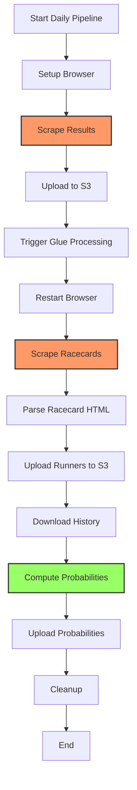

---

## AWS Infrastructure

### VPC and Networking

The system uses a custom VPC with public and private subnets:

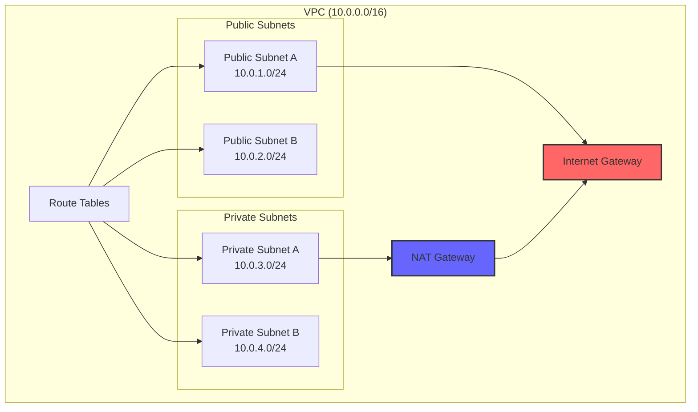

### ECS Cluster Architecture

The ECS cluster runs multiple task definitions:

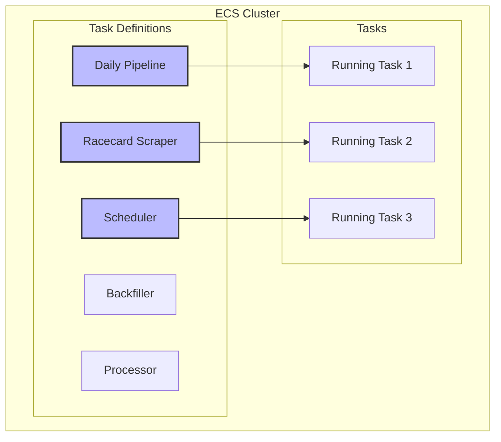

### S3 Bucket Structure

The S3 bucket is organized with the following prefix structure:

```
scraper-data-bucket/
├── raw/
│   ├── {YYYY}/
│   │   ├── {MM}/
│   │   │   ├── {DD}/
│   │   │   │   ├── racingpost-results-{date}.html
│   │   │   │   ├── racingpost-racecards-{date}.html
│   │   │   │   └── racingpost-racecards-{date}-racecards-html/
│   │   │   │       └── *.html
├── processed/
│   ├── {YYYY}/
│   │   ├── {MM}/
│   │   │   ├── {DD}/
│   │   │   │   ├── results-{date}.parquet
│   │   │   │   └── racecards-{date}.parquet
├── racecards/
│   ├── {YYYY}/
│   │   ├── {MM}/
│   │   │   ├── {DD}/
│   │   │   │   └── racingpost-racecards-{date}-runners.parquet
└── probabilities/
    ├── {YYYY}/
    │   ├── {MM}/
    │   │   ├── {DD}/
    │   │   │   └── racecard-probabilities-{date}-{HHMMSS}.parquet
```

### Lambda and API Gateway

The Lambda function serves HTML reports through API Gateway:


### IAM Roles and Policies

The system uses multiple IAM roles with least-privilege access:

- **ECS Task Role**: Permissions for S3 read/write, ECS task execution
- **Lambda Execution Role**: Permissions for S3 read, CloudWatch logs
- **Glue Role**: Permissions for S3 read/write, Glue catalog operations

---

## Daily Pipeline

### Pipeline Orchestration

The daily pipeline is orchestrated by `daily_pipeline.sh`, which coordinates all scraping and processing steps:

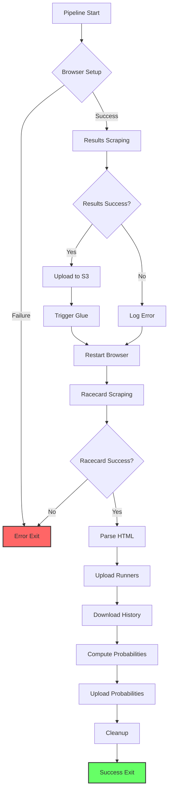

### Browser Management

The pipeline uses Xvfb and Chromium for headless browsing:

1. **Xvfb Setup**: Virtual X server on display :99
2. **Chromium Launch**: Headless Chrome with remote debugging on port 9222
3. **Connection**: Rust scrapers connect via CDP protocol
4. **Cleanup**: Processes are killed after pipeline completion

### Time-Based Filtering

The racecard scraper filters out past races based on Europe/London timezone:

1. **Time Extraction**: Parses race times from HTML JSON or proximity matching
2. **Timezone Conversion**: Interprets times as Europe/London, converts to UTC
3. **Current Time Comparison**: Filters out races before current London time
4. **Logging**: Logs skipped races with their London time

---

## Scheduling System

### Dynamic Scheduling

The scheduling system (`schedule_today.py`) creates EventBridge rules based on actual race times:

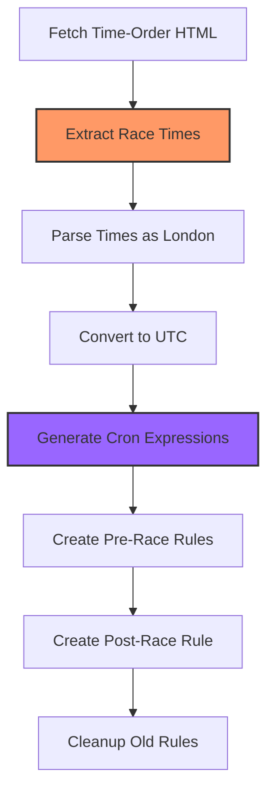

### Rule Naming Convention

EventBridge rules follow this naming pattern:

- **Pre-race**: `rps-pipeline-pre-{YYYYMMDD}-{HHMM}`
- **Post-race**: `rps-pipeline-post-{YYYYMMDD}-{HHMM}`

The timestamp in the name reflects the London time of the race, while the cron expression uses UTC.

### Timezone Handling

All race times are interpreted as Europe/London:

1. **ISO 8601 Parsing**: With or without timezone offset
2. **Naive Datetime**: Treated as London time
3. **Conversion**: Converted to UTC for cron expressions
4. **Display**: Shown in London time in logs and rule names

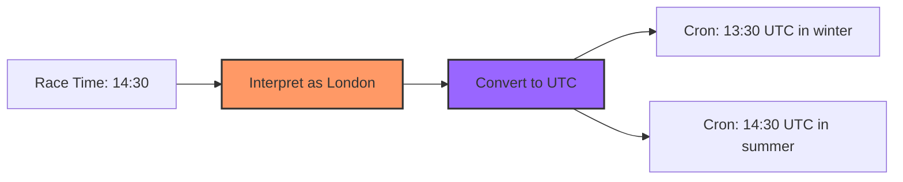

---

## Rust Application Structure

### Module Organization

The Rust application is organized into several modules:

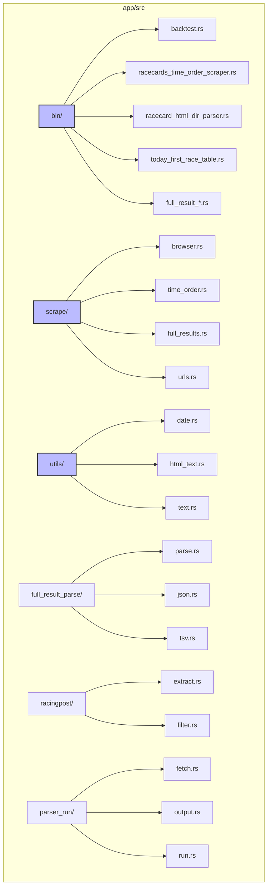

### Scraping Module

The `scrape` module handles browser automation and data fetching:

- **browser.rs**: Chromium connection and CDP interaction
- **time_order.rs**: Time-order page scraping
- **full_results.rs**: Full results page scraping
- **urls.rs**: URL extraction and normalization

### Parser Module

The `full_result_parse` module parses HTML into structured data:

- **parse.rs**: Main parsing logic
- **json.rs**: JSON data extraction
- **tsv.rs**: TSV data extraction

### Utilities

The `utils` module provides common utilities:

- **date.rs**: Date/time utilities with timezone support
- **html_text.rs**: HTML text extraction
- **text.rs**: Text processing utilities

---

## Lambda Function

### Lambda Architecture

The Lambda function (`lambda_function.py`) serves HTML reports:

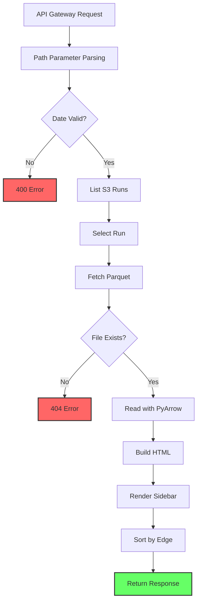

### HTML Report Structure

The HTML report includes:

- **Sidebar**: List of available runs by date
- **Title**: Links to latest run
- **Race Cards**: Each race in a Bootstrap card
- **Tables**: Horse data with bookmaker odds, model probabilities, edge
- **Totals**: Column totals for each race
- **Styling**: Bootstrap 5 with alternating row colors

### Edge Calculation

Edge is calculated as: `model_prob - bookie_prob`

Where `bookie_prob = 1 / bookie_odds`

Positive edge indicates the model gives higher probability than bookmakers imply.

---

## S3 Data Organization

### Prefix Structure

Data is organized by date in S3:

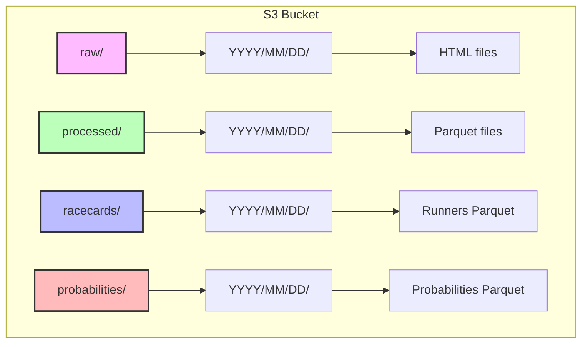

### File Naming Conventions

- **Raw HTML**: `racingpost-results-{date}.html`
- **Racecard HTML**: `racingpost-racecards-{date}.html`
- **Runners Parquet**: `racingpost-racecards-{date}-runners.parquet`
- **Probabilities Parquet**: `racecard-probabilities-{date}-{HHMMSS}.parquet`

The timestamp in probabilities files uses Europe/London timezone.

---

## Timezone Handling

### Europe/London Timezone

The system consistently uses Europe/London timezone for race times:

1. **Default Date**: Computed in London timezone
2. **Race Time Parsing**: Naive times interpreted as London
3. **Scheduling**: Cron expressions in UTC, display in London
4. **File Naming**: Timestamps in London timezone

### Timezone Conversion Flow


### Chrono-TZ Integration

The Rust application uses `chrono-tz` for timezone operations:

```rust
use chrono_tz::Europe::London;

// Convert UTC to London
let london_time = utc_time.with_timezone(&London);

// Interpret naive datetime as London
let london_dt = London.from_local_datetime(&naive_dt).earliest()?;
```

---

## Error Handling

### Pipeline Error Handling

The daily pipeline includes error handling at each step:

1. **Browser Setup**: Retry logic with timeout
2. **Scraping**: Non-fatal errors logged, pipeline continues
3. **Upload**: AWS errors logged, may retry
4. **Processing**: Glue failures logged, may be acceptable
5. **Cleanup**: Always executed regardless of errors

### Lambda Error Handling

The Lambda function handles errors gracefully:

- **Invalid Date**: Returns 400 with error message
- **Missing File**: Returns 404 with helpful message
- **Parse Errors**: Returns 500 with error details
- **S3 Errors**: Returns 500 with error details

### Rust Error Handling

Rust applications use `anyhow` for error propagation:

```rust
use anyhow::{Context, Result};

fn scrape_data() -> Result<Data> {
    let html = fetch_html()
        .context("Failed to fetch HTML")?;
    let data = parse_html(&html)
        .context("Failed to parse HTML")?;
    Ok(data)
}
```

---

## Deployment

### Docker Build Process

The Dockerfile builds all Rust binaries:

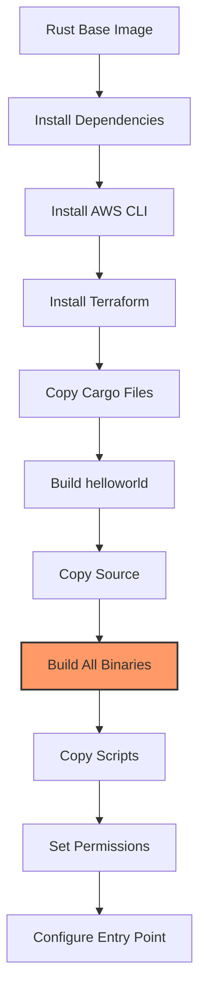

### Terraform Deployment

Infrastructure is deployed via Terraform:

```bash
terraform init
terraform plan
terraform apply
```

### ECS Task Deployment

Task definitions are updated when code changes:

1. Build new Docker image
2. Push to ECR
3. Update task definition
4. ECS automatically uses new definition

---

## Monitoring and Logging

### CloudWatch Logs

All components log to CloudWatch:

- **ECS Tasks**: Task logs in CloudWatch Logs
- **Lambda Function**: Lambda logs with request/response
- **Glue Jobs**: Glue execution logs

### Key Metrics to Monitor

- **Pipeline Success Rate**: Daily pipeline completion
- **Scraping Latency**: Time to scrape racecards
- **Processing Time**: Time to compute probabilities
- **Lambda Latency**: API response time
- **Error Rates**: Failed scrapes, processing errors

### Alerting

Consider setting up CloudWatch alarms for:

- Pipeline failures
- High error rates
- Lambda timeout errors
- S3 access errors

---

## Security Considerations

### IAM Least Privilege

All IAM roles follow least privilege:

- **ECS Tasks**: Only S3 access for specific prefixes
- **Lambda**: Only S3 read access
- **Glue**: Only S3 access for data processing

### Secrets Management

- **AWS Credentials**: Use IAM roles, not access keys
- **Environment Variables**: Sensitive data in AWS Secrets Manager
- **No Hardcoded Secrets**: All credentials from environment

### Network Security

- **VPC**: Private subnets for processing
- **Security Groups**: Restrictive inbound/outbound rules
- **NAT Gateway**: Controlled internet access

### Data Security

- **Encryption at Rest**: S3 bucket encryption enabled
- **Encryption in Transit**: TLS for all communications
- **Access Logging**: S3 access logs enabled

---

## Performance Considerations

### Scraping Performance

- **Headless Browser**: Chromium with GPU disabled
- **Parallel Processing**: Tokio async runtime
- **Connection Pooling**: Reuse browser connections
- **Timeout Handling**: Configurable timeouts for each operation

### Data Processing Performance

- **Parquet Format**: Columnar storage for efficient queries
- **PyArrow**: Fast Parquet reading in Lambda
- **Glue**: Distributed processing for large datasets
- **Caching**: S3 caching for frequently accessed data

### Lambda Performance

- **Memory Size**: 512MB for PyArrow operations
- **Timeout**: 30 seconds for report generation
- **Layer**: AWS SDK for Pandas for efficient S3 access
- **Cold Starts**: Minimize by keeping Lambda warm

---

## Scalability

### Horizontal Scaling

- **ECS**: Auto-scaling based on CPU/memory
- **Lambda**: Automatic scaling with requests
- **S3**: Virtually unlimited storage
- **API Gateway**: Automatic scaling

### Vertical Scaling

- **Task Memory**: Configurable per task definition
- **Lambda Memory**: Adjustable based on needs
- **Glue Workers**: Configurable DPU allocation

### Bottlenecks

- **Scraping**: Limited by Racing Post rate limits
- **Processing**: Limited by Glue DPU allocation
- **API**: Limited by Lambda concurrency

---

## Backup and Recovery

### S3 Versioning

Consider enabling S3 versioning for:

- Raw HTML files
- Processed Parquet files
- Probabilities reports

### Terraform State

Terraform state stored in S3 with:

- State locking via DynamoDB
- Versioning enabled
- Regular backups

### Disaster Recovery

- **Infrastructure**: Re-deploy via Terraform
- **Data**: Restore from S3 backups
- **Configuration**: Stored in Git repository

---

## Testing Strategy

### Unit Testing

- **Rust**: Cargo test for modules
- **Python**: pytest for Lambda function
- **Terraform**: terraform validate

### Integration Testing

- **Pipeline**: Test with sample dates
- **Lambda**: Test against S3 test data
- **API**: Test endpoints with curl

### End-to-End Testing

- **Full Pipeline**: Run complete daily pipeline
- **Report Generation**: Verify HTML output
- **Scheduling**: Verify EventBridge rules

---

## Future Enhancements

### Potential Improvements

1. **Real-time Updates**: WebSocket for live race updates
2. **Machine Learning**: Enhanced probability models
3. **Mobile App**: Native mobile application
4. **Historical Analysis**: Extended backtesting capabilities
5. **Alerting**: SMS/email alerts for high-edge opportunities
6. **API Expansion**: REST API for data access
7. **Dashboard**: Real-time monitoring dashboard
8. **Multi-sport**: Support for other sports

### Technical Debt

- **Error Handling**: More granular error types
- **Testing**: Increase test coverage
- **Documentation**: API documentation
- **Monitoring**: Enhanced metrics and dashboards
- **Configuration**: Externalize configuration

---

## Appendix

### Environment Variables

| Variable | Purpose | Default |
|----------|---------|---------|
| `RESULTS_DATE` | Date to process | Current UTC date |
| `SCRAPER_DATA_BUCKET_NAME` | S3 bucket name | Required |
| `AWS_REGION` | AWS region | eu-west-2 |
| `AWS_PROFILE` | AWS profile | None |

### API Endpoints

- `GET /` - Latest probabilities report
- `GET /{date}` - Probabilities for specific date
- `GET /{date}?run={HHMMSS}` - Specific run for date

### File Locations

- **Dockerfile**: `/Dockerfile`
- **Daily Pipeline**: `/scripts/daily_pipeline.sh`
- **Scheduler**: `/scripts/schedule_today.py`
- **Lambda**: `/terraform/lambda_function.py`
- **Terraform**: `/terraform/`

### Dependencies

**Rust**:
- `chromiumoxide` - Browser automation
- `tokio` - Async runtime
- `serde` - Serialization
- `chrono` - Date/time handling
- `chrono-tz` - Timezone support
- `arrow` - Arrow/Parquet support

**Python**:
- `boto3` - AWS SDK
- `pyarrow` - Parquet reading
- `zoneinfo` - Timezone support

**Terraform**:
- `aws` - AWS provider (~> 6.0)

---

## Conclusion

This architecture documentation provides a comprehensive overview of the Racing Post Scraper system. The system is designed for reliability, scalability, and maintainability, with clear separation of concerns between data collection, processing, and presentation layers.

The use of modern technologies (Rust, Terraform, AWS serverless) ensures the system can handle the workload efficiently while remaining cost-effective. The timezone-aware scheduling and filtering ensure data is collected at the right times, and the Lambda-powered reporting provides a responsive user experience.

For questions or contributions, please refer to the project repository.
