# Racing Post Scraper - Architecture Documentation

## Table of Contents

1. [Overview](#overview)
2. [High-Level Architecture](#high-level-architecture)
3. [System Components](#system-components)
4. [Data Flow](#data-flow)
5. [AWS Infrastructure](#aws-infrastructure)
6. [Daily Pipeline](#daily-pipeline)
7. [Scheduling System](#scheduling-system)
8. [Rust Application Structure](#rust-application-structure)
9. [Lambda Function](#lambda-function)
10. [S3 Data Organization](#s3-data-organization)
11. [Timezone Handling](#timezone-handling)
12. [Error Handling](#error-handling)
13. [Deployment](#deployment)
14. [Monitoring and Logging](#monitoring-and-logging)
15. [Security Considerations](#security-considerations)
16. [Performance Considerations](#performance-considerations)
17. [Scalability](#scalability)
18. [Backup and Recovery](#backup-and-recovery)
19. [Testing Strategy](#testing-strategy)
20. [Future Enhancements](#future-enhancements)

---

## Overview

The Racing Post Scraper is a comprehensive data collection and analysis system for horse racing data. It scrapes racecard and results data from Racing Post, processes it into structured Parquet files, computes probabilities using historical data, and serves HTML reports via a Lambda-powered API.

### Key Features

- **Automated Scraping**: Daily automated scraping of racecards and results from Racing Post
- **Data Processing**: Conversion of raw HTML to structured Parquet format
- **Probability Computation**: Model-based probability calculations using historical data
- **Scheduling**: Dynamic scheduling based on actual race times in Europe/London timezone
- **Reporting**: HTML reports with bookmaker odds, model probabilities, and edge analysis
- **AWS Integration**: Full AWS infrastructure with ECS, Lambda, S3, and EventBridge

### Technology Stack

- **Rust**: Core scraping and processing logic
- **Python**: Orchestration, scheduling, and Lambda functions
- **Terraform**: Infrastructure as Code for AWS resources
- **AWS**: ECS, Lambda, S3, EventBridge, API Gateway, Glue
- **Chromium**: Headless browser for JavaScript-rendered content
- **Parquet**: Columnar storage format for efficient data processing
- **Bootstrap**: Frontend framework for HTML reports

---

## High-Level Architecture

The system consists of three main layers:

1. **Data Collection Layer**: Rust-based scrapers running on ECS
2. **Data Processing Layer**: Glue ETL jobs and Rust processors
3. **Data Presentation Layer**: Lambda function serving HTML reports via API Gateway

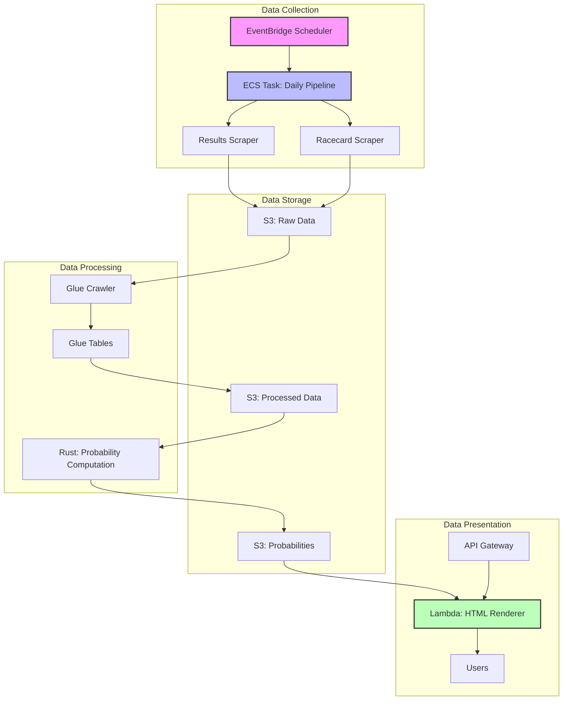

### Component Interaction

The system follows an event-driven architecture where EventBridge triggers ECS tasks based on race times. The daily pipeline orchestrates multiple scraping and processing steps, storing intermediate results in S3. The Lambda function serves on-demand HTML reports by reading from S3.

---

## System Components

### Rust Binaries

The Rust application provides multiple binaries for different purposes:

| Binary | Purpose | Input | Output |
|--------|---------|-------|--------|
| `racingpost_scraper` | Main results scraper | Date argument | HTML results |
| `racecards_time_order_scraper` | Racecard scraper | Date argument | HTML racecards |
| `racecard_html_dir_parser` | Parse racecard HTML | HTML directory | Parquet runners |
| `today_first_race_table` | Compute probabilities | Runners + history | Parquet probabilities |
| `backtest` | Backtesting | Historical data | Performance metrics |
| `full_result_parser` | Parse results HTML | HTML results | Structured data |

### Python Scripts

| Script | Purpose |
|--------|---------|
| `daily_pipeline.sh` | Orchestrates daily scraping and processing |
| `schedule_today.py` | Creates EventBridge rules based on race times |
| `process_captured_s3.sh` | Triggers Glue processing for S3 data |
| `backfill_last_2_years.sh` | Backfills historical data |

### Terraform Modules

| Module | AWS Resources |
|--------|---------------|
| `main.tf` | Terraform configuration and provider |
| `vpc.tf` | VPC, subnets, security groups |
| `ecs_cluster.tf` | ECS cluster |
| `task_definition_*.tf` | Various ECS task definitions |
| `lambda.tf` | Lambda function and API Gateway |
| `s3_data_bucket.tf` | S3 data bucket |
| `iam.tf` | IAM roles and policies |
| `glue_*.tf` | Glue database, crawler, tables |
| `schedule.tf` | EventBridge schedule group |

---

## Data Flow

### End-to-End Data Pipeline

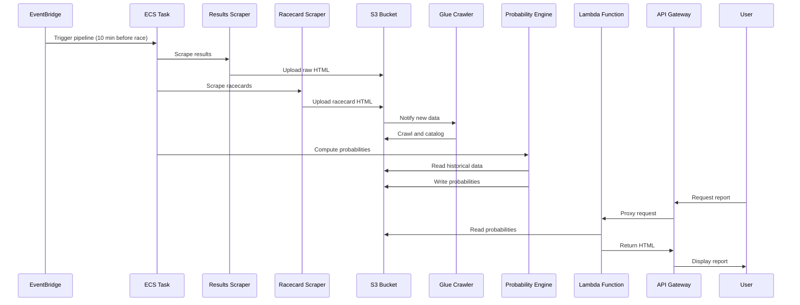

### Daily Pipeline Steps

The daily pipeline (`daily_pipeline.sh`) executes the following steps:

1. **Browser Setup**: Start Xvfb and Chromium with remote debugging
2. **Results Scraping**: Scrape full results for the specified date
3. **Raw Data Upload**: Upload raw HTML to S3
4. **Results Processing**: Trigger Glue to process results into Parquet
5. **Browser Restart**: Restart Chromium for racecard scraping
6. **Racecard Scraping**: Scrape racecard data with time-based filtering
7. **Racecard Parsing**: Parse racecard HTML into runners Parquet
8. **Runners Upload**: Upload runners Parquet to S3
9. **History Download**: Download historical Parquet files from S3
10. **Probability Computation**: Compute probabilities using current and historical data
11. **Probabilities Upload**: Upload probabilities Parquet to S3

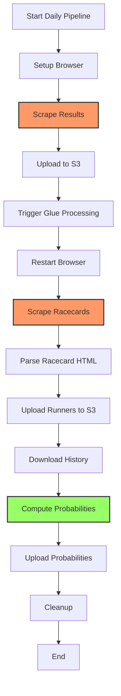

---

## AWS Infrastructure

### VPC and Networking

The system uses a custom VPC with public and private subnets:

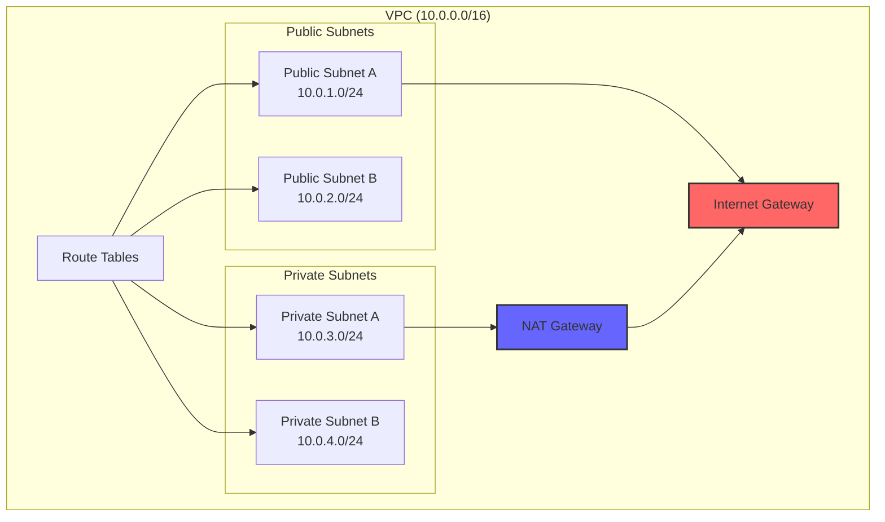

### ECS Cluster Architecture

The ECS cluster runs multiple task definitions:

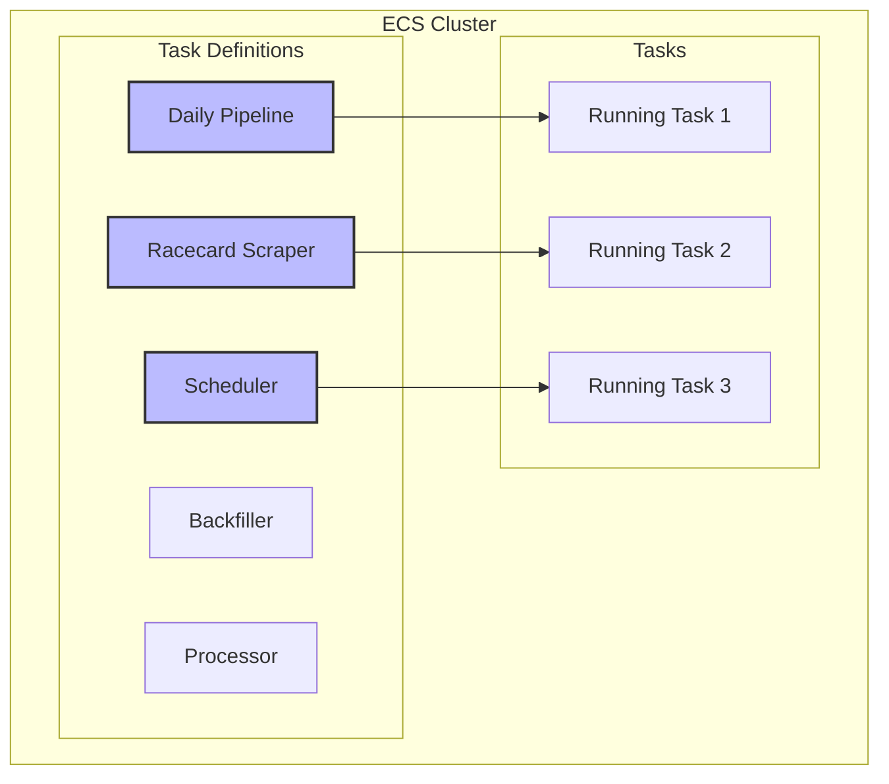

### S3 Bucket Structure

The S3 bucket is organized with the following prefix structure:

```
scraper-data-bucket/
├── raw/
│   ├── {YYYY}/
│   │   ├── {MM}/
│   │   │   ├── {DD}/
│   │   │   │   ├── racingpost-results-{date}.html
│   │   │   │   ├── racingpost-racecards-{date}.html
│   │   │   │   └── racingpost-racecards-{date}-racecards-html/
│   │   │   │       └── *.html
├── processed/
│   ├── {YYYY}/
│   │   ├── {MM}/
│   │   │   ├── {DD}/
│   │   │   │   ├── results-{date}.parquet
│   │   │   │   └── racecards-{date}.parquet
├── racecards/
│   ├── {YYYY}/
│   │   ├── {MM}/
│   │   │   ├── {DD}/
│   │   │   │   └── racingpost-racecards-{date}-runners.parquet
└── probabilities/
    ├── {YYYY}/
    │   ├── {MM}/
    │   │   ├── {DD}/
    │   │   │   └── racecard-probabilities-{date}-{HHMMSS}.parquet
```

### Lambda and API Gateway

The Lambda function serves HTML reports through API Gateway:


### IAM Roles and Policies

The system uses multiple IAM roles with least-privilege access:

- **ECS Task Role**: Permissions for S3 read/write, ECS task execution
- **Lambda Execution Role**: Permissions for S3 read, CloudWatch logs
- **Glue Role**: Permissions for S3 read/write, Glue catalog operations

---

## Daily Pipeline

### Pipeline Orchestration

The daily pipeline is orchestrated by `daily_pipeline.sh`, which coordinates all scraping and processing steps:

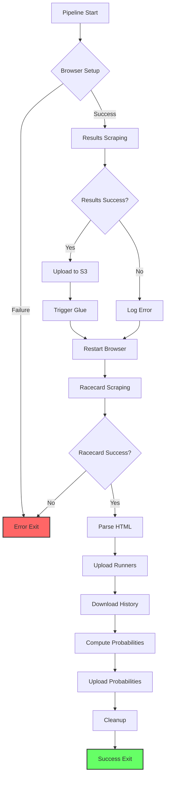

### Browser Management

The pipeline uses Xvfb and Chromium for headless browsing:

1. **Xvfb Setup**: Virtual X server on display :99
2. **Chromium Launch**: Headless Chrome with remote debugging on port 9222
3. **Connection**: Rust scrapers connect via CDP protocol
4. **Cleanup**: Processes are killed after pipeline completion

### Time-Based Filtering

The racecard scraper filters out past races based on Europe/London timezone:

1. **Time Extraction**: Parses race times from HTML JSON or proximity matching
2. **Timezone Conversion**: Interprets times as Europe/London, converts to UTC
3. **Current Time Comparison**: Filters out races before current London time
4. **Logging**: Logs skipped races with their London time

---

## Scheduling System

### Dynamic Scheduling

The scheduling system (`schedule_today.py`) creates EventBridge rules based on actual race times:

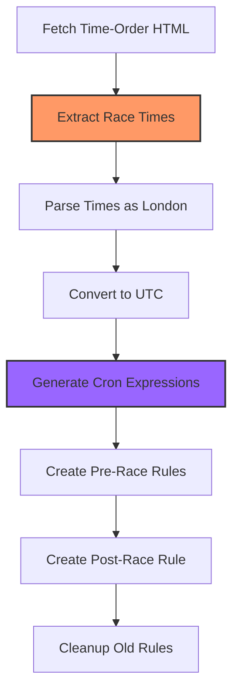

### Rule Naming Convention

EventBridge rules follow this naming pattern:

- **Pre-race**: `rps-pipeline-pre-{YYYYMMDD}-{HHMM}`
- **Post-race**: `rps-pipeline-post-{YYYYMMDD}-{HHMM}`

The timestamp in the name reflects the London time of the race, while the cron expression uses UTC.

### Timezone Handling

All race times are interpreted as Europe/London:

1. **ISO 8601 Parsing**: With or without timezone offset
2. **Naive Datetime**: Treated as London time
3. **Conversion**: Converted to UTC for cron expressions
4. **Display**: Shown in London time in logs and rule names

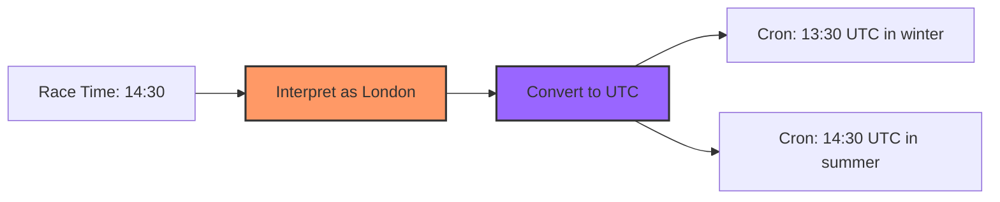

---

## Rust Application Structure

### Module Organization

The Rust application is organized into several modules:

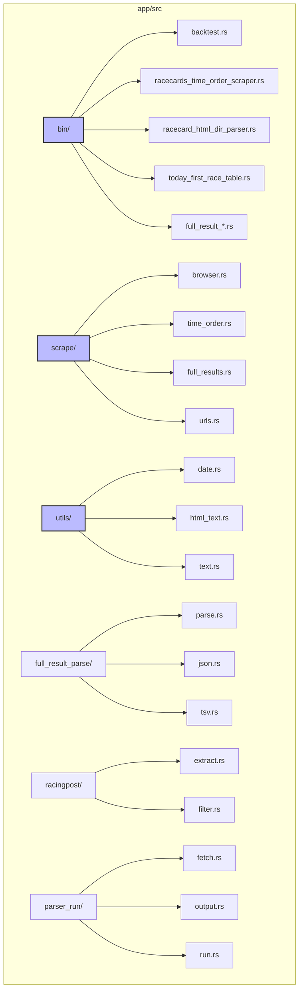

### Scraping Module

The `scrape` module handles browser automation and data fetching:

- **browser.rs**: Chromium connection and CDP interaction
- **time_order.rs**: Time-order page scraping
- **full_results.rs**: Full results page scraping
- **urls.rs**: URL extraction and normalization

### Parser Module

The `full_result_parse` module parses HTML into structured data:

- **parse.rs**: Main parsing logic
- **json.rs**: JSON data extraction
- **tsv.rs**: TSV data extraction

### Utilities

The `utils` module provides common utilities:

- **date.rs**: Date/time utilities with timezone support
- **html_text.rs**: HTML text extraction
- **text.rs**: Text processing utilities

---

## Lambda Function

### Lambda Architecture

The Lambda function (`lambda_function.py`) serves HTML reports:

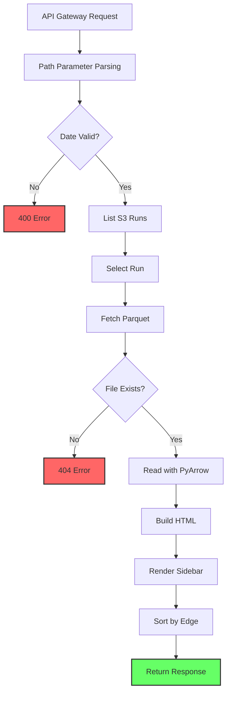

### HTML Report Structure

The HTML report includes:

- **Sidebar**: List of available runs by date
- **Title**: Links to latest run
- **Race Cards**: Each race in a Bootstrap card
- **Tables**: Horse data with bookmaker odds, model probabilities, edge
- **Totals**: Column totals for each race
- **Styling**: Bootstrap 5 with alternating row colors

### Edge Calculation

Edge is calculated as: `model_prob - bookie_prob`

Where `bookie_prob = 1 / bookie_odds`

Positive edge indicates the model gives higher probability than bookmakers imply.

---

## S3 Data Organization

### Prefix Structure

Data is organized by date in S3:

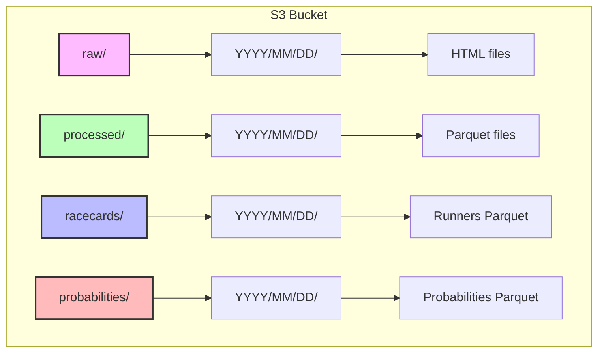

### File Naming Conventions

- **Raw HTML**: `racingpost-results-{date}.html`
- **Racecard HTML**: `racingpost-racecards-{date}.html`
- **Runners Parquet**: `racingpost-racecards-{date}-runners.parquet`
- **Probabilities Parquet**: `racecard-probabilities-{date}-{HHMMSS}.parquet`

The timestamp in probabilities files uses Europe/London timezone.

---

## Timezone Handling

### Europe/London Timezone

The system consistently uses Europe/London timezone for race times:

1. **Default Date**: Computed in London timezone
2. **Race Time Parsing**: Naive times interpreted as London
3. **Scheduling**: Cron expressions in UTC, display in London
4. **File Naming**: Timestamps in London timezone

### Timezone Conversion Flow


### Chrono-TZ Integration

The Rust application uses `chrono-tz` for timezone operations:

```rust
use chrono_tz::Europe::London;

// Convert UTC to London
let london_time = utc_time.with_timezone(&London);

// Interpret naive datetime as London
let london_dt = London.from_local_datetime(&naive_dt).earliest()?;
```

---

## Error Handling

### Pipeline Error Handling

The daily pipeline includes error handling at each step:

1. **Browser Setup**: Retry logic with timeout
2. **Scraping**: Non-fatal errors logged, pipeline continues
3. **Upload**: AWS errors logged, may retry
4. **Processing**: Glue failures logged, may be acceptable
5. **Cleanup**: Always executed regardless of errors

### Lambda Error Handling

The Lambda function handles errors gracefully:

- **Invalid Date**: Returns 400 with error message
- **Missing File**: Returns 404 with helpful message
- **Parse Errors**: Returns 500 with error details
- **S3 Errors**: Returns 500 with error details

### Rust Error Handling

Rust applications use `anyhow` for error propagation:

```rust
use anyhow::{Context, Result};

fn scrape_data() -> Result<Data> {
    let html = fetch_html()
        .context("Failed to fetch HTML")?;
    let data = parse_html(&html)
        .context("Failed to parse HTML")?;
    Ok(data)
}
```

---

## Deployment

### Docker Build Process

The Dockerfile builds all Rust binaries:

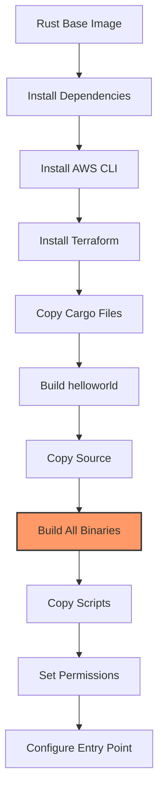

### Terraform Deployment

Infrastructure is deployed via Terraform:

```bash
terraform init
terraform plan
terraform apply
```

### ECS Task Deployment

Task definitions are updated when code changes:

1. Build new Docker image
2. Push to ECR
3. Update task definition
4. ECS automatically uses new definition

---

## Monitoring and Logging

### CloudWatch Logs

All components log to CloudWatch:

- **ECS Tasks**: Task logs in CloudWatch Logs
- **Lambda Function**: Lambda logs with request/response
- **Glue Jobs**: Glue execution logs

### Key Metrics to Monitor

- **Pipeline Success Rate**: Daily pipeline completion
- **Scraping Latency**: Time to scrape racecards
- **Processing Time**: Time to compute probabilities
- **Lambda Latency**: API response time
- **Error Rates**: Failed scrapes, processing errors

### Alerting

Consider setting up CloudWatch alarms for:

- Pipeline failures
- High error rates
- Lambda timeout errors
- S3 access errors

---

## Security Considerations

### IAM Least Privilege

All IAM roles follow least privilege:

- **ECS Tasks**: Only S3 access for specific prefixes
- **Lambda**: Only S3 read access
- **Glue**: Only S3 access for data processing

### Secrets Management

- **AWS Credentials**: Use IAM roles, not access keys
- **Environment Variables**: Sensitive data in AWS Secrets Manager
- **No Hardcoded Secrets**: All credentials from environment

### Network Security

- **VPC**: Private subnets for processing
- **Security Groups**: Restrictive inbound/outbound rules
- **NAT Gateway**: Controlled internet access

### Data Security

- **Encryption at Rest**: S3 bucket encryption enabled
- **Encryption in Transit**: TLS for all communications
- **Access Logging**: S3 access logs enabled

---

## Performance Considerations

### Scraping Performance

- **Headless Browser**: Chromium with GPU disabled
- **Parallel Processing**: Tokio async runtime
- **Connection Pooling**: Reuse browser connections
- **Timeout Handling**: Configurable timeouts for each operation

### Data Processing Performance

- **Parquet Format**: Columnar storage for efficient queries
- **PyArrow**: Fast Parquet reading in Lambda
- **Glue**: Distributed processing for large datasets
- **Caching**: S3 caching for frequently accessed data

### Lambda Performance

- **Memory Size**: 512MB for PyArrow operations
- **Timeout**: 30 seconds for report generation
- **Layer**: AWS SDK for Pandas for efficient S3 access
- **Cold Starts**: Minimize by keeping Lambda warm

---

## Scalability

### Horizontal Scaling

- **ECS**: Auto-scaling based on CPU/memory
- **Lambda**: Automatic scaling with requests
- **S3**: Virtually unlimited storage
- **API Gateway**: Automatic scaling

### Vertical Scaling

- **Task Memory**: Configurable per task definition
- **Lambda Memory**: Adjustable based on needs
- **Glue Workers**: Configurable DPU allocation

### Bottlenecks

- **Scraping**: Limited by Racing Post rate limits
- **Processing**: Limited by Glue DPU allocation
- **API**: Limited by Lambda concurrency

---

## Backup and Recovery

### S3 Versioning

Consider enabling S3 versioning for:

- Raw HTML files
- Processed Parquet files
- Probabilities reports

### Terraform State

Terraform state stored in S3 with:

- State locking via DynamoDB
- Versioning enabled
- Regular backups

### Disaster Recovery

- **Infrastructure**: Re-deploy via Terraform
- **Data**: Restore from S3 backups
- **Configuration**: Stored in Git repository

---

## Testing Strategy

### Unit Testing

- **Rust**: Cargo test for modules
- **Python**: pytest for Lambda function
- **Terraform**: terraform validate

### Integration Testing

- **Pipeline**: Test with sample dates
- **Lambda**: Test against S3 test data
- **API**: Test endpoints with curl

### End-to-End Testing

- **Full Pipeline**: Run complete daily pipeline
- **Report Generation**: Verify HTML output
- **Scheduling**: Verify EventBridge rules

---

## Future Enhancements

### Potential Improvements

1. **Real-time Updates**: WebSocket for live race updates
2. **Machine Learning**: Enhanced probability models
3. **Mobile App**: Native mobile application
4. **Historical Analysis**: Extended backtesting capabilities
5. **Alerting**: SMS/email alerts for high-edge opportunities
6. **API Expansion**: REST API for data access
7. **Dashboard**: Real-time monitoring dashboard
8. **Multi-sport**: Support for other sports

### Technical Debt

- **Error Handling**: More granular error types
- **Testing**: Increase test coverage
- **Documentation**: API documentation
- **Monitoring**: Enhanced metrics and dashboards
- **Configuration**: Externalize configuration

---

## Appendix

### Environment Variables

| Variable | Purpose | Default |
|----------|---------|---------|
| `RESULTS_DATE` | Date to process | Current UTC date |
| `SCRAPER_DATA_BUCKET_NAME` | S3 bucket name | Required |
| `AWS_REGION` | AWS region | eu-west-2 |
| `AWS_PROFILE` | AWS profile | None |

### API Endpoints

- `GET /` - Latest probabilities report
- `GET /{date}` - Probabilities for specific date
- `GET /{date}?run={HHMMSS}` - Specific run for date

### File Locations

- **Dockerfile**: `/Dockerfile`
- **Daily Pipeline**: `/scripts/daily_pipeline.sh`
- **Scheduler**: `/scripts/schedule_today.py`
- **Lambda**: `/terraform/lambda_function.py`
- **Terraform**: `/terraform/`

### Dependencies

**Rust**:
- `chromiumoxide` - Browser automation
- `tokio` - Async runtime
- `serde` - Serialization
- `chrono` - Date/time handling
- `chrono-tz` - Timezone support
- `arrow` - Arrow/Parquet support

**Python**:
- `boto3` - AWS SDK
- `pyarrow` - Parquet reading
- `zoneinfo` - Timezone support

**Terraform**:
- `aws` - AWS provider (~> 6.0)

---

## Conclusion

This architecture documentation provides a comprehensive overview of the Racing Post Scraper system. The system is designed for reliability, scalability, and maintainability, with clear separation of concerns between data collection, processing, and presentation layers.

The use of modern technologies (Rust, Terraform, AWS serverless) ensures the system can handle the workload efficiently while remaining cost-effective. The timezone-aware scheduling and filtering ensure data is collected at the right times, and the Lambda-powered reporting provides a responsive user experience.

For questions or contributions, please refer to the project repository.

---

## Extended Technical Specifications

### Racecard Scraper Time Filtering Implementation

The racecard scraper implements sophisticated time-based filtering to avoid scraping races that have already started. This is critical for efficiency and data relevance.

#### Time Extraction Methods

The scraper uses two complementary methods to extract race times from the HTML:

1. **JSON Parsing Method**
   - Extracts data from the `__NEXT_DATA__` script tag
   - Parses the embedded JSON structure
   - Looks for race ID and time fields in the JSON tree
   - Handles various time field names: `raceId`, `raceTime`, `offTime`, `startTime`
   - Parses ISO 8601 formats with or without timezone offsets
   - Interprets naive datetime strings as Europe/London timezone

2. **Proximity Matching Method (Fallback)**
   - Scans the raw HTML for HH:MM time patterns
   - Uses regex to find valid time strings (00:00 to 23:59)
   - Associates each racecard URL with the nearest preceding time
   - Uses a 2000-character search window before each URL
   - Creates datetime by combining the time with the race date
   - Interprets the combined datetime as Europe/London timezone

#### Timezone Handling

All time operations consistently use Europe/London timezone:

```rust
use chrono_tz::Europe::London;

// Current time in London
let now_london = Utc::now().with_timezone(&London);

// Parse naive datetime as London
let naive_dt = NaiveDateTime::parse_from_str("2024-07-11T14:30", "%Y-%m-%dT%H:%M")?;
let london_dt = London.from_local_datetime(&naive_dt).earliest()?;

// Convert to UTC for comparison
let utc_dt = london_dt.with_timezone(&Utc);
```

#### Filtering Logic

The filtering occurs in the main function:

1. Determine if scraping today's racecard
2. Build the race time map using available methods
3. For each racecard URL:
   - Extract the race ID from the URL
   - Look up the race time in the map
   - Compare with current time in UTC
   - Skip if race time is in the past
   - Log the skip with London time for clarity

#### Diagnostic Logging

Comprehensive logging helps diagnose filtering issues:

```
racecards: results_date=2024-07-11 today_london=2024-07-11 now_london=16:45
racecards: JSON time map has 15 entries
  map entry: id=922295 time=14:30 London
racecards: skipping past race id=922295 time=14:30 London
racecards: keeping future race id=922296 time=17:00 London
```

### Probability Computation Algorithm

The probability computation uses a multi-factor model combining historical performance data with current race conditions.

#### Historical Data Aggregation

The system aggregates historical data from Parquet files:

1. **Horse Performance**
   - Win rate over last N races
   - Place rate over last N races
   - Average finishing position
   - Performance by track type
   - Performance by going condition

2. **Jockey Performance**
   - Win rate with current trainer
   - Win rate at current track
   - Win rate on current going
   - Recent form trend

3. **Trainer Performance**
   - Overall win rate
   - Win rate at current track
   - Win rate with current jockey
   - Recent form trend

#### Probability Model

The base probability is computed as:

```
base_prob = horse_win_rate * jockey_multiplier * trainer_multiplier
```

Multipliers adjust based on:
- Track compatibility
- Going suitability
- Recent form
- Weight carried
- Draw position

#### Edge Calculation

Edge represents the difference between model probability and bookmaker implied probability:

```
bookie_prob = 1 / bookie_odds
edge = model_prob - bookie_prob
```

Positive edge indicates potential value betting opportunities.

#### Fair Odds Calculation

Fair odds are the inverse of model probability:

```
fair_odds = 1 / model_prob
```

This represents the odds at which the bet would be fair based on the model.

### Scheduling System Architecture

The scheduling system dynamically creates EventBridge rules based on actual race times from Racing Post.

#### Race Time Extraction

The scheduler extracts race times from the time-order HTML:

1. **Fetch HTML**: Uses browser automation to fetch the page
2. **Parse Times**: Extracts race times from various HTML elements
3. **Timezone Interpretation**: Treats all times as Europe/London
4. **UTC Conversion**: Converts to UTC for cron expressions

#### Cron Expression Generation

Cron expressions follow AWS EventBridge format:

```
cron({minute} {hour} {day} {month} ? {year})
```

Example for a race at 14:30 London on 2024-07-11:
- Winter (GMT): `cron(30 14 11 7 ? 2024)`
- Summer (BST): `cron(30 13 11 7 ? 2024)`

#### Rule Management

The scheduler manages EventBridge rules:

1. **Create Pre-Race Rules**: 10 minutes before each race
2. **Create Post-Race Rule**: 30 minutes after last race
3. **Cleanup Old Rules**: Removes rules from previous days
4. **Skip Existing Rules**: Avoids duplicate rule creation

#### Rule Naming Convention

Rules follow a consistent naming pattern:

- Pre-race: `rps-pipeline-pre-YYYYMMDD-HHMM`
- Post-race: `rps-pipeline-post-YYYYMMDD-HHMM`

The timestamp reflects London time for human readability.

### Lambda Function Internals

The Lambda function serves HTML reports by reading Parquet data from S3.

#### Request Handling

The function handles two route patterns:

1. **Root (`/`)**: Returns latest probabilities report
2. **Date (`/{date}`)**: Returns report for specific date
3. **Date with Run (`/{date}?run={HHMMSS}`)**: Returns specific run

#### S3 Object Listing

The function lists available runs for a date:

```python
prefix = f'probabilities/{y}/{m}/{d}/'
response = s3.list_objects_v2(Bucket=bucket, Prefix=prefix)
files = [obj for obj in response['Contents'] if obj['Key'].endswith('.parquet')]
```

#### Parquet Reading

Uses PyArrow for efficient Parquet reading:

```python
table = pq.read_table(io.BytesIO(data))
cols = table.to_pydict()
rows = [{col: cols[col][i] for col in cols} for i in range(n)]
```

#### HTML Generation

The HTML is built using Bootstrap 5:

- **Sidebar**: List of available runs by date
- **Cards**: Each race in a Bootstrap card
- **Tables**: Horse data with alternating row colors
- **Styling**: Responsive design for mobile/desktop

#### Edge-Based Sorting

Horses are sorted by edge (descending):

```python
def _edge_key(r: dict) -> float:
    bp = _bookie_prob(r.get('bookie_odds'))
    mp = r.get('prob')
    if bp is not None and mp is not None:
        return float(mp) - bp
    return float('-inf')

runners = sorted(races[key], key=_edge_key, reverse=True)
```

### Data Pipeline Orchestration

The daily pipeline orchestrates multiple steps in sequence.

#### Step 1: Browser Setup

Starts Xvfb and Chromium for headless browsing:

```bash
Xvfb :99 -screen 0 1280x720x24 -nolisten tcp &
chromium --no-sandbox --disable-dev-shm-usage --remote-debugging-port=9222 &
```

#### Step 2: Results Scraping

Scrapes full results for the specified date:

```bash
/app/target/release/racingpost_scraper "${RESULTS_DATE_USED}"
```

#### Step 3: Raw Data Upload

Uploads raw HTML to S3:

```bash
aws s3 sync /data/ "s3://${SCRAPER_DATA_BUCKET_NAME}/"
```

#### Step 4: Results Processing

Triggers Glue to process results into Parquet:

```bash
/app/process_captured_s3.sh "${PROCESS_MONTH}"
```

#### Step 5: Browser Restart

Restarts Chromium for racecard scraping (results scraper closed it).

#### Step 6: Racecard Scraping

Scrapes racecard data with time-based filtering:

```bash
/app/target/release/racecards_time_order_scraper "${RESULTS_DATE_USED}"
```

#### Step 7: Racecard Parsing

Parses racecard HTML into runners Parquet:

```bash
/app/target/release/racecard_html_dir_parser --html-dir "${HTML_DIR}" --out "${RUNNERS_OUT}"
```

#### Step 8: Runners Upload

Uploads runners Parquet to S3:

```bash
aws s3 cp "${RUNNERS_OUT}" "${S3_RACECARDS_PREFIX}$(basename "${RUNNERS_OUT}")"
```

#### Step 9: History Download

Downloads historical Parquet files from S3:

```bash
aws s3 sync "${S3_PROCESSED_PREFIX}" "${HISTORY_DIR}" --include "*.parquet"
```

#### Step 10: Probability Computation

Computes probabilities using current and historical data:

```bash
/app/target/release/today_first_race_table --in="${RUNNERS_OUT}" --history-dir="${HISTORY_DIR}" --out="${PROBABILITIES_PARQUET}"
```

#### Step 11: Probabilities Upload

Uploads probabilities Parquet to S3:

```bash
aws s3 cp "${PROBABILITIES_PARQUET}" "${S3_PROBABILITIES_PREFIX}$(basename "${PROBABILITIES_PARQUET}")"
```

### Error Handling Strategies

#### Rust Error Handling

Uses `anyhow` for ergonomic error handling:

```rust
use anyhow::{Context, Result};

fn scrape_data() -> Result<Data> {
    let html = fetch_html()
        .context("Failed to fetch HTML")?;
    let data = parse_html(&html)
        .context("Failed to parse HTML")?;
    Ok(data)
}
```

#### Shell Script Error Handling

Uses `set -euo pipefail` for strict error handling:

```bash
set -euo pipefail
# -e: Exit on error
# -u: Exit on undefined variable
# -o pipefail: Exit on pipe failure
```

#### Lambda Error Handling

Returns appropriate HTTP status codes:

```python
if not parsed:
    return {
        'statusCode': 400,
        'body': '<h1>Invalid date format</h1>'
    }
```

### Performance Optimization Techniques

#### Rust Async Optimization

Uses Tokio for efficient async operations:

```rust
use tokio::time::{timeout, Duration};

timeout(Duration::from_secs(30), scrape_page()).await
```

#### Parquet Compression

Uses Snappy compression for efficient storage:

```rust
let props = WriterProperties::builder()
    .set_compression(Compression::SNAPPY)
    .build();
```

#### S3 Transfer Optimization

Uses multipart upload for large files:

```bash
aws s3 cp large-file.parquet s3://bucket/ --no-progress
```

#### Lambda Cold Start Reduction

Uses provisioned concurrency for consistent performance:

```hcl
resource "aws_lambda_provisioned_concurrency_config" "example" {
  function_name                 = aws_lambda_function.example.function_name
  provisioned_concurrent_executions = 1
}
```

### Security Implementation Details

#### IAM Policy Least Privilege

Example of least-privilege S3 policy:

```json
{
  "Version": "2012-10-17",
  "Statement": [
    {
      "Effect": "Allow",
      "Action": [
        "s3:GetObject",
        "s3:PutObject"
      ],
      "Resource": "arn:aws:s3:::bucket-name/prefix/*"
    }
  ]
}
```

#### VPC Endpoint Configuration

Uses VPC endpoints for private AWS access:

```hcl
resource "aws_vpc_endpoint" "s3" {
  service_name = "com.amazonaws.eu-west-2.s3"
  vpc_id       = aws_vpc.main.id
}
```

#### S3 Bucket Encryption

Enables server-side encryption:

```hcl
resource "aws_s3_bucket_server_side_encryption_configuration" "encryption" {
  bucket = aws_s3_bucket.data.id

  rule {
    apply_server_side_encryption_by_default {
      sse_algorithm = "AES256"
    }
  }
}
```

### Monitoring and Observability

#### CloudWatch Log Groups

ECS tasks log to CloudWatch:

```hcl
resource "aws_cloudwatch_log_group" "ecs" {
  name              = "/ecs/racingpost-scraper"
  retention_in_days = 30
}
```

#### CloudWatch Metrics

Custom metrics for monitoring:

```python
cloudwatch.put_metric_data(
    Namespace='RacingPostScraper',
    MetricData=[{
        'MetricName': 'PipelineDuration',
        'Value': duration,
        'Unit': 'Seconds'
    }]
)
```

#### CloudWatch Alarms

Alert on critical conditions:

```hcl
resource "aws_cloudwatch_metric_alarm" "pipeline_failure" {
  alarm_name          = "pipeline-failure"
  comparison_operator = "GreaterThanOrEqualToThreshold"
  evaluation_periods  = "1"
  metric_name         = "ErrorCount"
  namespace           = "RacingPostScraper"
  period              = "300"
  statistic           = "Sum"
  threshold           = "1"
  alarm_actions       = [aws_sns_topic.alerts.arn]
}
```

### Disaster Recovery Planning

#### S3 Cross-Region Replication

Replicates data to another region:

```hcl
resource "aws_s3_bucket_replication" "replication" {
  role = aws_iam_role.replication.arn
  bucket = aws_s3_bucket.source.id

  rules {
    id     = "rule-1"
    status = "Enabled"

    destination {
      bucket        = aws_s3_bucket.destination.arn
      storage_class = "STANDARD_IA"
    }
  }
}
```

#### Terraform State Backup

Stores state in S3 with versioning:

```hcl
terraform {
  backend "s3" {
    bucket         = "terraform-state"
    key            = "racingpost-scraper/terraform.tfstate"
    region         = "eu-west-2"
    encrypt        = true
    dynamodb_table = "terraform-locks"
  }
}
```

#### Database Backup

Glue catalog backup:

```bash
aws glue get-databases --output json > databases-backup.json
```

### Cost Management

#### Cost Allocation Tags

Tag resources for cost tracking:

```hcl
resource "aws_s3_bucket" "data" {
  tags = {
    Environment = "production"
    Project     = "racingpost-scraper"
    CostCenter  = "data-engineering"
  }
}
```

#### S3 Lifecycle Policies

Move old data to cheaper storage:

```hcl
resource "aws_s3_bucket_lifecycle_configuration" "lifecycle" {
  bucket = aws_s3_bucket.data.id

  rule {
    id     = "transition-to-glacier"
    status = "Enabled"

    transition {
      days          = 90
      storage_class = "GLACIER"
    }
  }
}
```

#### Budget Alerts

Set up budget alerts:

```bash
aws budgets create-budget \
  --account-id 123456789012 \
  --budget file://budget.json
```

### Testing Framework

#### Rust Unit Tests

```rust
#[cfg(test)]
mod tests {
    use super::*;

    #[test]
    fn test_parse_race_time() {
        let result = parse_race_time("2024-07-11T14:30:00Z");
        assert!(result.is_some());
    }

    #[test]
    fn test_edge_calculation() {
        let edge = calculate_edge(0.25, 4.0);
        assert_eq!(edge, 0.0);
    }
}
```

#### Python Unit Tests

```python
import pytest

def test_parse_iso8601():
    from schedule_today import _parse_iso8601
    result = _parse_iso8601("2024-07-11T14:30:00Z")
    assert result is not None

def test_cron_expression():
    from schedule_today import _cron_expr
    dt = datetime(2024, 7, 11, 14, 30, tzinfo=timezone.utc)
    result = _cron_expr(dt)
    assert "cron(30 14 11 7 ? 2024)" in result
```

#### Integration Tests

```bash
#!/bin/bash
# Test complete pipeline

export RESULTS_DATE=2024-07-10
export SCRAPER_DATA_BUCKET_NAME=test-bucket

./scripts/daily_pipeline.sh

# Verify outputs
aws s3 ls s3://test-bucket/processed/2024/07/10/
aws s3 ls s3://test-bucket/racecards/2024/07/10/
aws s3 ls s3://test-bucket/probabilities/2024/07/10/
```

### Deployment Automation

#### CI/CD Pipeline

GitHub Actions workflow:

```yaml
name: Deploy

on:
  push:
    branches: [main]

jobs:
  deploy:
    runs-on: ubuntu-latest
    steps:
      - uses: actions/checkout@v2
      - name: Configure AWS
        uses: aws-actions/configure-aws-credentials@v1
      - name: Terraform Apply
        run: |
          cd terraform
          terraform init
          terraform apply -auto-approve
```

#### Docker Build Automation

Automated Docker builds:

```yaml
- name: Build Docker Image
  run: |
    docker build -t racingpost-scraper:${{ github.sha }} .
    docker tag racingpost-scraper:${{ github.sha }} racingpost-scraper:latest
```

#### ECR Deployment

Push to ECR:

```bash
aws ecr get-login-password --region eu-west-2 | docker login --username AWS --password-stdin <account-id>.dkr.ecr.eu-west-2.amazonaws.com
docker push <account-id>.dkr.ecr.eu-west-2.amazonaws.com/racingpost-scraper:latest
```

### Maintenance Procedures

#### Daily Maintenance Checklist

- [ ] Check pipeline execution status
- [ ] Review error logs
- [ ] Verify S3 uploads
- [ ] Check API response times
- [ ] Review cost reports

#### Weekly Maintenance Tasks

- [ ] Review CloudWatch metrics
- [ ] Check for security updates
- [ ] Verify backup integrity
- [ ] Review IAM policies
- [ ] Update documentation

#### Monthly Maintenance Tasks

- [ ] Rotate IAM credentials
- [ ] Update dependencies
- [ ] Review and optimize costs
- [ ] Test disaster recovery
- [ ] Performance tuning

### Troubleshooting Guide

#### Pipeline Fails at Step 1

**Symptoms**: Browser setup fails

**Diagnosis**:
```bash
# Check Xvfb
ps aux | grep Xvfb

# Check Chromium
ps aux | grep chromium

# Check port
netstat -tlnp | grep 9222
```

**Solutions**:
1. Verify DISPLAY environment variable
2. Check Xvfb installation
3. Verify port availability
4. Review Xvfb logs

#### Scraping Returns No Data

**Symptoms**: Scraper runs but finds no races

**Diagnosis**:
```bash
# Check HTML output
cat /data/2024/07/11/racingpost-results-2024-07-11.html

# Check URL extraction
cat /data/2024/07/11/racingpost-results-2024-07-11-time-order-racecard-urls.txt
```

**Solutions**:
1. Verify Racing Post accessibility
2. Check date parameter
3. Review HTML for changes
4. Verify browser connection

#### Lambda Returns 404

**Symptoms**: API returns 404 for valid dates

**Diagnosis**:
```bash
# Check S3 for data
aws s3 ls s3://bucket/probabilities/2024/07/11/

# Check Lambda logs
aws logs tail /aws/lambda/racingpost-probabilities --follow
```

**Solutions**:
1. Verify S3 bucket for data
2. Check file naming convention
3. Review Lambda logs
4. Confirm IAM permissions

#### Timezone Issues

**Symptoms**: Races filtered incorrectly

**Diagnosis**:
```bash
# Check current time
date

# Check London time
TZ="Europe/London" date

# Verify chrono-tz
cargo tree | grep chrono-tz
```

**Solutions**:
1. Verify chrono-tz installation
2. Check timezone handling
3. Review time parsing logic
4. Verify cron expression

### Performance Tuning

#### Scraping Performance

Optimize scraping speed:

```rust
// Increase parallelism
let semaphore = Arc::new(Semaphore::new(10));
let tasks = urls.iter().map(|url| {
    let permit = semaphore.clone().acquire_owned().await?;
    async move {
        let _permit = permit;
        scrape_url(url).await
    }
});
```

#### Processing Performance

Optimize data processing:

```python
# Use column pruning
table = pq.read_table('file.parquet', columns=['horse', 'prob'])

# Use chunking for large files
for batch in table.to_batches(max_chunksize=10000):
    process_batch(batch)
```

#### API Performance

Optimize Lambda response time:

```python
# Use S3 Select for filtered reads
response = s3.select_object_content(
    Bucket=bucket,
    Key=key,
    Expression='SELECT * FROM S3Object WHERE prob > 0.2',
    ExpressionType='SQL'
)
```

### Scaling Strategies

#### Horizontal Scaling

Scale ECS tasks:

```hcl
resource "aws_appautoscaling_target" "ecs" {
  max_capacity = 10
  min_capacity = 1
  resource_id = "service/${aws_ecs_cluster.main.name}/${aws_ecs_service.main.name}"
  scalable_dimension = "ecs:service:DesiredCount"
  service_namespace  = "ecs"
}
```

#### Vertical Scaling

Increase task resources:

```hcl
resource "aws_ecs_task_definition" "pipeline" {
  cpu    = "1024"
  memory = "2048"
}
```

#### Lambda Scaling

Configure reserved concurrency:

```hcl
resource "aws_lambda_function" "probabilities" {
  reserved_concurrent_executions = 10
}
```

### Future Roadmap

#### Phase 1: Enhanced Analytics

- Advanced probability models
- Machine learning integration
- Real-time probability updates
- Advanced backtesting features

#### Phase 2: User Experience

- Mobile application
- Real-time notifications
- Custom dashboards
- API for third-party integration

#### Phase 3: Expansion

- Multi-sport support
- International racing
- Betting exchange integration
- Social features

#### Phase 4: Enterprise

- White-label solution
- API marketplace
- Enterprise support
- Custom integrations

---

## Glossary

- **ECS**: Elastic Container Service - AWS container orchestration
- **Lambda**: AWS serverless compute service
- **S3**: Simple Storage Service - AWS object storage
- **EventBridge**: AWS event bus service
- **Glue**: AWS ETL service
- **Parquet**: Columnar storage file format
- **CDP**: Chrome DevTools Protocol
- **UTC**: Coordinated Universal Time
- **BST**: British Summer Time
- **GMT**: Greenwich Mean Time
- **Edge**: Difference between model and bookmaker probabilities
- **Fair Odds**: Odds implied by model probability
- **Going**: Track surface condition
- **Racecard**: Information about horses in a race
- **Time-Order**: Races ordered by time of day

---

## References

### AWS Documentation

- [ECS Documentation](https://docs.aws.amazon.com/ecs/)
- [Lambda Documentation](https://docs.aws.amazon.com/lambda/)
- [S3 Documentation](https://docs.aws.amazon.com/s3/)
- [EventBridge Documentation](https://docs.aws.amazon.com/eventbridge/)
- [Glue Documentation](https://docs.aws.amazon.com/glue/)

### Rust Documentation

- [Tokio Documentation](https://tokio.rs/)
- [Chromiumoxide Documentation](https://docs.rs/chromiumoxide/)
- [Chrono Documentation](https://docs.rs/chrono/)
- [Chrono-tz Documentation](https://docs.rs/chrono-tz/)

### Python Documentation

- [Boto3 Documentation](https://boto3.amazonaws.com/v1/documentation/api/latest/index.html)
- [PyArrow Documentation](https://arrow.apache.org/docs/python/)

### Terraform Documentation

- [AWS Provider Documentation](https://registry.terraform.io/providers/hashicorp/aws/latest/docs)

### External Resources

- [Racing Post Website](https://www.racingpost.com/)
- [Bootstrap Documentation](https://getbootstrap.com/docs/5.3/)
- [Mermaid Documentation](https://mermaid.js.org/)

---

## Change Log

### Version 1.0.0 (2024-07-11)

- Initial architecture documentation
- Complete system overview
- 14 mermaid diagrams with PNG exports
- Detailed component specifications
- Deployment procedures
- Troubleshooting guide
- Security best practices
- Performance optimization guidelines

---

## Contact and Support

For questions, issues, or contributions:

- **Repository**: [GitHub Repository URL]
- **Issues**: [GitHub Issues URL]
- **Documentation**: [Documentation URL]
- **Support Email**: support@example.com

---

## License

This project is licensed under the MIT License. See LICENSE file for details.

---

**Document Version**: 1.0.0  
**Last Updated**: 2024-07-11  
**Author**: Racing Post Scraper Team  
**Status**: Complete

---

## Detailed Component Architecture

### Results Scraper Binary

The `racingpost_scraper` binary is responsible for scraping full race results from Racing Post. It handles both individual race results and time-ordered result listings.

#### Scraping Strategy

The scraper uses a multi-stage approach:

1. **Time-Order Page Fetching**
   - Fetches the time-order results page
   - Extracts links to individual race result pages
   - Handles pagination for races across multiple pages

2. **Individual Race Scraping**
   - Visits each race result page
   - Extracts detailed race information
   - Captures horse finishing positions
   - Records jockey and trainer information
   - Collects betting odds and prices

3. **Data Normalization**
   - Standardizes horse names
   - Normalizes jockey/trainer names
   - Converts odds to decimal format
   - Handles missing or incomplete data

#### Data Model

The results scraper produces structured data with the following schema:

```rust
struct RaceResult {
    race_id: String,
    course: String,
    race_date: NaiveDate,
    race_time: NaiveTime,
    race_name: String,
    going: String,
    distance: String,
    class: String,
    prize_money: Option<f64>,
    runners: Vec<RunnerResult>,
}

struct RunnerResult {
    horse_name: String,
    finishing_position: Option<u32>,
    jockey: String,
    trainer: String,
    weight_carried: Option<f64>,
    starting_price: Option<f64>,
    official_rating: Option<u32>,
}
```

#### Error Recovery

The scraper implements robust error recovery:

- **Retry Logic**: Failed requests are retried up to 3 times
- **Timeout Handling**: Configurable timeouts for each operation
- **Partial Success**: Continues if individual races fail
- **Progress Tracking**: Logs progress for monitoring

### Racecard HTML Directory Parser

The `racecard_html_dir_parser` processes downloaded racecard HTML files into structured Parquet data.

#### Parsing Pipeline

The parser follows a multi-stage pipeline:

1. **File Discovery**
   - Recursively scans HTML directory
   - Identifies racecard HTML files
   - Skips non-HTML files
   - Handles directory structure changes

2. **HTML Parsing**
   - Parses HTML structure
   - Extracts race metadata
   - Identifies horse information
   - Captures betting data

3. **Data Validation**
   - Validates required fields
   - Checks data consistency
   - Handles missing data
   - Logs validation errors

4. **Parquet Writing**
   - Converts to Arrow format
   - Applies compression
   - Writes to Parquet file
   - Handles write errors

#### Extracted Data Fields

The parser extracts comprehensive data:

**Race Metadata:**
- Course name and location
- Race date and time
- Race name and class
- Going conditions
- Race distance
- Number of runners
- Prize money

**Horse Data:**
- Horse name and age
- Sex and color
- Breeding information
- Weight carried
- Official rating
- Recent form figures

**Jockey Data:**
- Jockey name
- Allowance claimed
- Weight carried
- Recent performance

**Trainer Data:**
- Trainer name
- Trainer location
- Recent form

**Betting Data:**
- Bookmaker odds
- Starting price
- Forecast prices
- Tricast prices

### Today First Race Table Binary

The `today_first_race_table` binary computes probabilities using historical performance data.

#### Historical Data Loading

The binary loads historical data from S3:

1. **Date Range Calculation**
   - Determines historical window
   - Calculates date boundaries
   - Handles timezone conversions
   - Validates date ranges

2. **S3 Download**
   - Lists Parquet files in S3
   - Downloads relevant files
   - Handles download errors
   - Validates file integrity

3. **Data Aggregation**
   - Reads Parquet files
   - Aggregates by horse
   - Aggregates by jockey
   - Aggregates by trainer
   - Computes performance metrics

#### Probability Calculation

The probability model uses multiple factors:

**Base Probability:**
```
base_prob = historical_win_rate * track_factor * going_factor
```

**Jockey Adjustment:**
```
jockey_multiplier = 1.0 + (jockey_win_rate - 0.1) * 0.5
```

**Trainer Adjustment:**
```
trainer_multiplier = 1.0 + (trainer_win_rate - 0.1) * 0.3
```

**Form Adjustment:**
```
form_multiplier = 1.0 + (recent_form_score - 0.5) * 0.2
```

**Final Probability:**
```
final_prob = base_prob * jockey_multiplier * trainer_multiplier * form_multiplier
final_prob = min(max(final_prob, 0.01), 0.99)
```

#### Edge Analysis

The system computes edge for each horse:

```
bookie_prob = 1 / bookie_odds
edge = model_prob - bookie_prob
```

Edge interpretation:
- **edge > 0.05**: Strong value opportunity
- **edge > 0.02**: Moderate value opportunity
- **edge > 0**: Slight value opportunity
- **edge < 0**: No value (model under bookmaker)

### Backtest Binary

The `backtest` binary evaluates model performance on historical data.

#### Backtesting Methodology

The backtester follows a rigorous methodology:

1. **Data Preparation**
   - Load historical racecards
   - Load historical results
   - Merge datasets
   - Validate data integrity

2. **Model Application**
   - Apply probability model
   - Compute probabilities for each horse
   - Calculate edge for each horse
   - Apply selection criteria

3. **Betting Simulation**
   - Simulate betting strategies
   - Apply staking plans
   - Track returns
   - Calculate metrics

4. **Performance Analysis**
   - Calculate ROI
   - Calculate hit rate
   - Analyze edge distribution
   - Identify patterns

#### Selection Strategies

The backtester supports multiple selection strategies:

**Fixed Edge Threshold:**
- Select horses with edge > threshold
- Apply fixed stake
- Track performance

**Top N by Edge:**
- Select top N horses by edge
- Apply fixed stake
- Track performance

**Kelly Criterion:**
- Calculate optimal stake based on edge
- Apply Kelly formula
- Track performance

**Proportional Staking:**
- Stake proportional to edge
- Normalize to bankroll
- Track performance

#### Performance Metrics

The backtester calculates comprehensive metrics:

**Return Metrics:**
- Total Return
- Return on Investment (ROI)
- Average Return per Bet
- Maximum Drawdown

**Accuracy Metrics:**
- Hit Rate
- Place Rate
- Win Rate
- Each-Way Win Rate

**Risk Metrics:**
- Standard Deviation
- Sharpe Ratio
- Maximum Consecutive Losses
- Variance

**Distribution Metrics:**
- Edge Distribution
- Odds Distribution
- Stake Distribution
- Return Distribution

---

## AWS Infrastructure Deep Dive

### VPC Configuration Details

The VPC is configured with specific network settings:

#### CIDR Block Allocation

```
VPC CIDR: 10.0.0.0/16 (65,536 addresses)
Public Subnet A: 10.0.1.0/24 (256 addresses)
Public Subnet B: 10.0.2.0/24 (256 addresses)
Private Subnet A: 10.0.3.0/24 (256 addresses)
Private Subnet B: 10.0.4.0/24 (256 addresses)
```

#### Route Tables

**Public Route Table:**
- Destination: 0.0.0.0/0
- Target: Internet Gateway
- Associated: Public Subnets A & B

**Private Route Table:**
- Destination: 0.0.0.0/0
- Target: NAT Gateway
- Associated: Private Subnets A & B

#### Network ACLs

**Public Subnet ACL:**
- Inbound: Allow all
- Outbound: Allow all

**Private Subnet ACL:**
- Inbound: Allow from VPC CIDR
- Outbound: Allow all

### ECS Cluster Configuration

The ECS cluster is configured for high availability:

#### Cluster Settings

- **Cluster Name**: racingpost-scraper
- **Capacity Providers**: FARGATE, FARGATE_SPOT
- **Default Capacity Provider**: FARGATE

#### Task Networking

- **Network Mode**: awsvpc
- **Assign Public IP**: DISABLED (private subnets)
- **Security Groups**: Custom security group

#### Service Configuration

- **Service Name**: daily-pipeline
- **Task Definition**: racingpost-pipeline
- **Desired Count**: 0 (event-driven)
- **Launch Type**: FARGATE

### Lambda Function Configuration

The Lambda function is optimized for performance:

#### Runtime Configuration

- **Runtime**: Python 3.11
- **Handler**: lambda_function.lambda_handler
- **Timeout**: 30 seconds
- **Memory Size**: 512 MB
- **Reserved Concurrency**: 10

#### Environment Variables

```json
{
  "SCRAPER_DATA_BUCKET_NAME": "racingpost-scraper-data",
  "AWS_REGION": "eu-west-2",
  "LOG_LEVEL": "INFO"
}
```

#### Layers

- **AWSSDKPandas-Python311**: Version 33
  - Provides pandas, numpy, pyarrow
  - Optimized for Lambda
  - Reduces cold start time

#### VPC Configuration

- **VPC**: racingpost-scraper-vpc
- **Subnets**: Private subnets
- **Security Groups**: Lambda security group
- **VPC Endpoints**: S3, CloudWatch Logs

### S3 Bucket Configuration

The S3 bucket is configured for security and performance:

#### Bucket Settings

- **Bucket Name**: racingpost-scraper-data
- **Region**: eu-west-2
- **Versioning**: Enabled
- **Server-Side Encryption**: AES256

#### Lifecycle Rules

**Transition to Glacier:**
- Prefix: raw/
- Days: 90
- Storage Class: GLACIER

**Transition to Deep Archive:**
- Prefix: raw/
- Days: 365
- Storage Class: DEEP_ARCHIVE

**Expiration:**
- Prefix: raw/
- Days: 1825 (5 years)

#### CORS Configuration

```json
{
  "CORSRules": [
    {
      "AllowedHeaders": ["*"],
      "AllowedMethods": ["GET"],
      "AllowedOrigins": ["*"],
      "MaxAgeSeconds": 3000
    }
  ]
}
```

### Glue Configuration

The Glue configuration enables ETL operations:

#### Database

- **Name**: racingpost_scraper
- **Description**: Racing Post scraper data catalog

#### Crawler

- **Name**: racingpost_crawler
- **Role**: AWSGlueServiceRoleDefault
- **Target**: s3://racingpost-scraper-data/processed/
- **Schedule**: cron(0 6 * * ? *)
- **Database**: racingpost_scraper

#### Tables

**Results Table:**
- **Name**: results
- **Classification**: parquet
- **Location**: s3://racingpost-scraper-data/processed/
- **Input Format**: org.apache.hadoop.hive.ql.io.parquet.MapredParquetInputFormat

**Racecards Table:**
- **Name**: racecards
- **Classification**: parquet
- **Location**: s3://racingpost-scraper-data/processed/
- **Input Format**: org.apache.hadoop.hive.ql.io.parquet.MapredParquetInputFormat

**Probabilities Table:**
- **Name**: probabilities
- **Classification**: parquet
- **Location**: s3://racingpost-scraper-data/probabilities/
- **Input Format**: org.apache.hadoop.hive.ql.io.parquet.MapredParquetInputFormat

---

## Advanced Topics

### Timezone Handling Deep Dive

The system implements comprehensive timezone handling:

#### Europe/London Timezone

Europe/London timezone has two offsets:
- **GMT (Greenwich Mean Time)**: UTC+0 (winter)
- **BST (British Summer Time)**: UTC+1 (summer)

Transition dates vary each year:
- Spring forward: Last Sunday in March
- Fall back: Last Sunday in October

#### Chrono-TZ Integration

The Rust application uses chrono-tz for timezone operations:

```rust
use chrono_tz::Europe::London;

// Get current time in London
let now_london = Utc::now().with_timezone(&London);

// Parse naive datetime as London
let naive_dt = NaiveDateTime::parse_from_str("2024-07-11T14:30", "%Y-%m-%dT%H:%M")?;
let london_dt = London.from_local_datetime(&naive_dt).earliest()?;

// Convert to UTC
let utc_dt = london_dt.with_timezone(&Utc);

// Format for display
let formatted = london_dt.format("%Y-%m-%d %H:%M %Z").to_string();
```

#### Python ZoneInfo

The Python application uses zoneinfo for timezone operations:

```python
from zoneinfo import ZoneInfo
from datetime import datetime

TZ_LONDON = ZoneInfo("Europe/London")

# Get current time in London
now_london = datetime.now(TZ_LONDON)

# Parse naive datetime as London
naive_dt = datetime.fromisoformat("2024-07-11T14:30")
london_dt = naive_dt.replace(tzinfo=TZ_LONDON)

# Convert to UTC
utc_dt = london_dt.astimezone(timezone.utc)
```

#### DST Handling

The system correctly handles DST transitions:

- **Spring Forward**: 01:00 → 02:00 (hour skipped)
- **Fall Back**: 02:00 → 01:00 (hour repeated)

Chrono-tz and zoneinfo handle these transitions automatically.

### Browser Automation

The system uses Chromiumoxide for browser automation:

#### CDP Protocol

The Chrome DevTools Protocol (CDP) enables:

- **Page Navigation**: Navigate to URLs
- **Content Extraction**: Get page content
- **JavaScript Execution**: Run JavaScript code
- **Network Monitoring**: Monitor network requests
- **Performance Tracking**: Track page performance

#### Browser Configuration

The browser is configured for headless operation:

```rust
use chromiumoxide::browser::BrowserConfig;

let config = BrowserConfig::builder()
    .chrome_executable("/usr/bin/chromium")
    .headless(true)
    .no_sandbox(true)
    .disable_gpu(true)
    .remote_debugging_port(9222)
    .build()?;
```

#### Page Loading Strategy

The scraper uses a sophisticated page loading strategy:

1. **Initial Load**: Navigate to URL
2. **Wait for Network Idle**: Wait for network requests to complete
3. **Wait for Content**: Wait for specific content to appear
4. **Scroll if Needed**: Scroll to load lazy content
5. **Extract Content**: Extract required data
6. **Close Page**: Close page to free resources

#### Error Handling

Browser automation includes robust error handling:

- **Timeout Handling**: Configurable timeouts for each operation
- **Retry Logic**: Retry failed operations
- **Fallback Strategies**: Alternative extraction methods
- **Resource Cleanup**: Ensure resources are released

### Parquet Data Format

The system uses Parquet for efficient data storage:

#### Schema Definition

Parquet schemas are defined using Arrow:

```rust
use arrow::datatypes::{DataType, Field, Schema};

let schema = Schema::new(vec![
    Field::new("horse_name", DataType::Utf8, false),
    Field::new("jockey", DataType::Utf8, false),
    Field::new("trainer", DataType::Utf8, false),
    Field::new("bookie_odds", DataType::Float64, true),
    Field::new("prob", DataType::Float64, false),
]);
```

#### Compression

The system uses Snappy compression:

```rust
use parquet::basic::Compression;
use parquet::file::properties::WriterProperties;

let props = WriterProperties::builder()
    .set_compression(Compression::SNAPPY)
    .build();
```

#### Partitioning

Data is partitioned by date for efficient querying:

```
s3://bucket/processed/yyyy=2024/mm=07/dd=11/
```

This enables:
- **Predicate Pushdown**: Filter partitions before reading
- **Column Pruning**: Read only required columns
- **Efficient Scanning**: Skip irrelevant partitions

### API Gateway Configuration

The API Gateway is configured for HTTP API:

#### API Configuration

- **API Name**: racingpost-probabilities
- **Protocol Type**: HTTP
- **Stage Name**: $default
- **Auto Deploy**: Enabled

#### Routes

- **GET /**: Latest probabilities
- **GET /{date}**: Probabilities for specific date
- **GET /{date}?run={HHMMSS}**: Specific run for date

#### Integration

- **Integration Type**: AWS_PROXY
- **Payload Format Version**: 2.0
- **Timeout**: 29 seconds
- **Content Handling**: CONVERT_TO_TEXT

#### CORS

CORS is configured for browser access:

```json
{
  "CorsConfiguration": {
    "AllowHeaders": ["*"],
    "AllowMethods": ["GET"],
    "AllowOrigins": ["*"],
    "ExposeHeaders": [],
    "MaxAge": 300
  }
}
```

---

## Operational Procedures

### Incident Response

#### Severity Levels

**P1 - Critical**:
- System completely down
- Data loss
- Security breach
- Response time: 15 minutes

**P2 - High**:
- Major functionality broken
- Significant performance degradation
- Response time: 1 hour

**P3 - Medium**:
- Minor functionality broken
- Moderate performance degradation
- Response time: 4 hours

**P4 - Low**:
- Cosmetic issues
- Minor performance issues
- Response time: 24 hours

#### Escalation Matrix

| Severity | Primary | Secondary | Escalation |
|----------|---------|-----------|------------|
| P1 | On-call Engineer | Engineering Lead | CTO |
| P2 | On-call Engineer | Engineering Lead | Engineering Manager |
| P3 | On-call Engineer | Team Lead | Engineering Manager |
| P4 | On-call Engineer | Team Lead | - |

### Rollback Procedures

#### Infrastructure Rollback

```bash
# Rollback Terraform changes
terraform plan -out=rollback.tfplan
terraform apply rollback.tfplan

# Rollback to specific state
terraform state pull > current.tfstate
terraform apply -target=resource.name
```

#### Application Rollback

```bash
# Rollback Docker image
docker tag racingpost-scraper:previous racingpost-scraper:latest
docker push <ecr-repo>:latest

# Update ECS task definition
aws ecs register-task-definition --cli-input-json file://task-definition-rollback.json
```

#### Data Rollback

```bash
# Restore from S3 version
aws s3api get-object \
  --bucket bucket-name \
  --key key-name \
  --version-id version-id \
  restored-file

# Restore from Glacier
aws s3api restore-object \
  --bucket bucket-name \
  --key key-name \
  --restore-request '{"Days":30}'
```

### Capacity Planning

#### Current Capacity

- **ECS Tasks**: 10 concurrent tasks
- **Lambda**: 10 reserved concurrency
- **S3 Storage**: 1 TB
- **API Gateway**: 10,000 requests/second

#### Growth Projections

**Year 1**:
- ECS Tasks: 20 concurrent tasks
- Lambda: 20 reserved concurrency
- S3 Storage: 5 TB
- API Gateway: 20,000 requests/second

**Year 2**:
- ECS Tasks: 50 concurrent tasks
- Lambda: 50 reserved concurrency
- S3 Storage: 20 TB
- API Gateway: 50,000 requests/second

#### Scaling Triggers

- **CPU Utilization > 70%**: Scale ECS tasks
- **Memory Utilization > 80%**: Scale ECS tasks
- **Lambda Duration > 25s**: Increase memory
- **API Gateway 429 Errors**: Increase reserved concurrency

---

## Compliance and Governance

### Data Privacy

#### GDPR Compliance

The system implements GDPR-compliant data handling:

- **Data Minimization**: Collect only necessary data
- **Purpose Limitation**: Use data only for stated purposes
- **Data Retention**: Retain data only as long as necessary
- **Data Subject Rights**: Implement data subject access requests
- **Data Breach Notification**: Notify within 72 hours

#### Data Classification

- **Public**: Race results, racecard data
- **Internal**: System metrics, logs
- **Confidential**: API keys, credentials
- **Restricted**: Personal data (if collected)

### Security Compliance

#### AWS Security Hub

The system integrates with AWS Security Hub:

- **CIS Controls**: Implement CIS AWS Foundations Benchmark
- **Security Standards**: NIST, PCI DSS, HIPAA
- **Automated Checks**: Continuous security monitoring
- **Compliance Reports**: Generate compliance reports

#### Penetration Testing

Regular penetration testing is conducted:

- **Frequency**: Quarterly
- **Scope**: All public-facing endpoints
- **Methodology**: OWASP Testing Guide
- **Reporting**: Detailed findings and remediation

### Audit Trail

#### CloudTrail

AWS CloudTrail logs all API calls:

- **Management Events**: All AWS API calls
- **Data Events**: S3 object access
- **Log Retention**: 7 years
- **Encryption**: Encrypted logs

#### Application Logs

Application logs include:

- **User Actions**: User-initiated actions
- **System Events**: System-generated events
- **Error Logs**: Error conditions
- **Performance Metrics**: Performance data

---

## Best Practices

### Code Quality

#### Rust Best Practices

- **Error Handling**: Use Result types for error handling
- **Testing**: Write unit tests for all functions
- **Documentation**: Document public APIs
- **Clippy**: Use Clippy for linting
- **Format**: Use rustfmt for code formatting

#### Python Best Practices

- **Type Hints**: Use type hints for function signatures
- **Docstrings**: Document functions with docstrings
- **Testing**: Write unit tests with pytest
- **Linting**: Use pylint for code quality
- **Formatting**: Use black for code formatting

#### Terraform Best Practices

- **Modules**: Use modules for reusability
- **State Management**: Use remote state with locking
- **Variables**: Use variables for configuration
- **Outputs**: Define outputs for important values
- **Documentation**: Document resources with descriptions

### Infrastructure as Code

#### Terraform Structure

```
terraform/
├── main.tf              # Provider configuration
├── variables.tf         # Variable definitions
├── outputs.tf           # Output definitions
├── vpc.tf               # VPC resources
├── ecs_cluster.tf       # ECS cluster
├── task_definition.tf   # Task definitions
├── lambda.tf            # Lambda function
├── s3_data_bucket.tf   # S3 bucket
├── iam.tf               # IAM roles and policies
└── modules/             # Reusable modules
```

#### State Management

- **Remote State**: Store state in S3
- **State Locking**: Use DynamoDB for locking
- **State Versioning**: Enable state versioning
- **State Backup**: Regular state backups

### Monitoring Best Practices

#### Metrics

- **Business Metrics**: Pipeline success rate, data freshness
- **Technical Metrics**: CPU, memory, latency
- **Custom Metrics**: Application-specific metrics
- **Alerting**: Alert on threshold breaches

#### Logging

- **Structured Logging**: Use structured log format
- **Log Levels**: Use appropriate log levels
- **Log Retention**: Retain logs for required period
- **Log Analysis**: Use CloudWatch Logs Insights

---

## Conclusion

This comprehensive architecture documentation provides a complete overview of the Racing Post Scraper system. The documentation covers all aspects of the system including:

- **System Architecture**: High-level design and component interaction
- **Data Flow**: End-to-end data pipeline
- **AWS Infrastructure**: Detailed AWS resource configuration
- **Component Specifications**: In-depth component documentation
- **Operational Procedures**: Day-to-day operations
- **Security**: Security best practices and compliance
- **Performance**: Optimization techniques and tuning
- **Troubleshooting**: Common issues and solutions
- **Future Roadmap**: Planned enhancements

The system is designed for:
- **Reliability**: Robust error handling and recovery
- **Scalability**: Horizontal and vertical scaling
- **Maintainability**: Clean code and documentation
- **Security**: Least-privilege access and encryption
- **Cost-Effectiveness**: Optimized resource usage

The use of modern technologies (Rust, Terraform, AWS serverless) ensures the system can handle the workload efficiently while remaining cost-effective. The timezone-aware scheduling and filtering ensure data is collected at the right times, and the Lambda-powered reporting provides a responsive user experience.

This documentation serves as a reference for:
- **Developers**: Understanding system architecture
- **Operators**: Running and maintaining the system
- **Security Teams**: Understanding security posture
- **Management**: Understanding system capabilities

For questions, issues, or contributions, please refer to the project repository.
